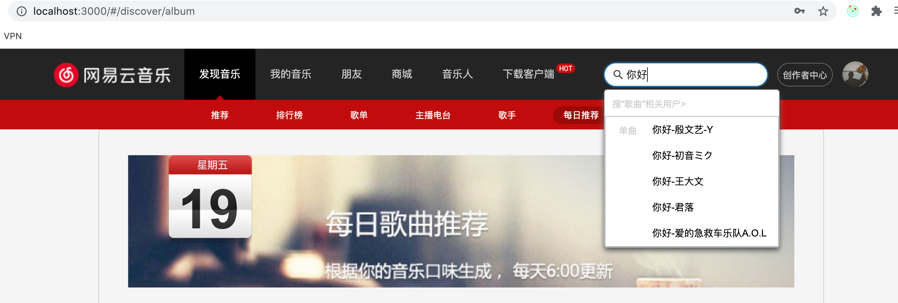

## 项目介绍

### 1、目标

使用React相关技术栈尝试开发网易云音乐PC网站

### 2、实现功能模块

#### 2.1）底部音乐播放器(含播放列表)

- 功能介绍
  - 滑块控制当前音乐播放时间（<audio>标签与滑块联动：currenttime控制滑动，拖动滑块改变currenttime）
  - 点击按钮/播放列表控制歌曲切换
  - 切换音乐列表播放顺序（循环/随机/顺序）
  - 展开播放列表后歌词实时滚动（根据当前歌词索引触发scrollTo，使高亮保持在第四行）
  - 播放列表收起时，若歌曲播放，用组件`message`实时显示歌词（组件`message`和播放列表互斥）

- 开发收获

  这一模块是项目的难点，主要是**组件内部的音乐播放逻辑**以及**对外开放的API**（供其他组件去切换播放音乐、添加音乐列表等操作），核心是**getSongDetailAction**，对选择的歌曲先在列表中判断是否存在，对于不存在的加入playList，再播放

#### 2.2）个人登录+每日推荐模块

- 功能介绍
  - 支持手机号+密码的个人登录模式
  - 根据登录状态切换header的展示状态
  - 根据登录后账户的cookie获取对应的推荐列表，用组件`songItem`进行渲染
  - 组件`songItem`调用音乐播放器组件提供的API，点击可进行歌曲切换、添加至播放列表
  - 登录鉴权（只能登录后查看每日推荐）

#### 2.3）搜索栏

- 功能介绍
  - 根据输入关键词调用后台API进行检索，并将返回结果渲染
  - 点击歌曲选项可调用音乐播放器组件提供的API，点击可进行歌曲切换、添加至播放列表

#### 2.4）热门推荐的展示

- 功能介绍

  该模块主要用来练习样式布局等基本功，布局主要采用flex

  - 轮播图组件的实现（后台请求数据，用antd组件库的`Carousel`进行渲染）
  - 热门推荐的实现（目前只是展示，没有交互功能）

#### 2.5）路由切换

- 功能介绍
  - 使用`react-router-config`集中配置路由
  - react-router-dom的<NavLink>进行路由切换

### 3、技术栈

- 使用`create-react-app`脚手架（封装的webpack）初始化项目结构，并使用carco配置路径别名
- 使用`react-router-config`集中式配置路由表
- 使用`style-in-js`的方式编写样式（`styled-components`）
- 使用`axios`发送网络请求
- 使用react hooks（useState/useEffect/useCallback/useRef）
- 使用组件库`antd`（message/Input/Dropdown/Menu/Carousel...）
- 使用`react-redux`（store存储全局共享状态）和`redux-thunk`中间件（完成异步操作，发送请求加载数据）
- 使用`propType`校验`props`类型及默认值

