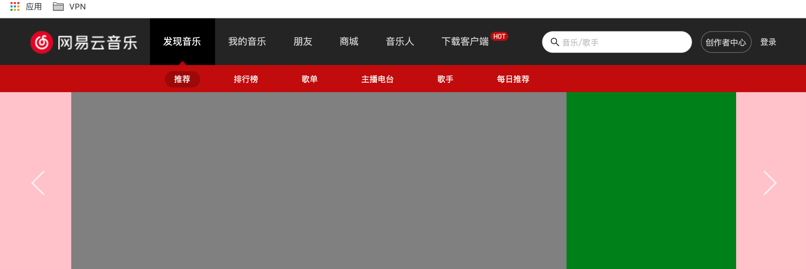
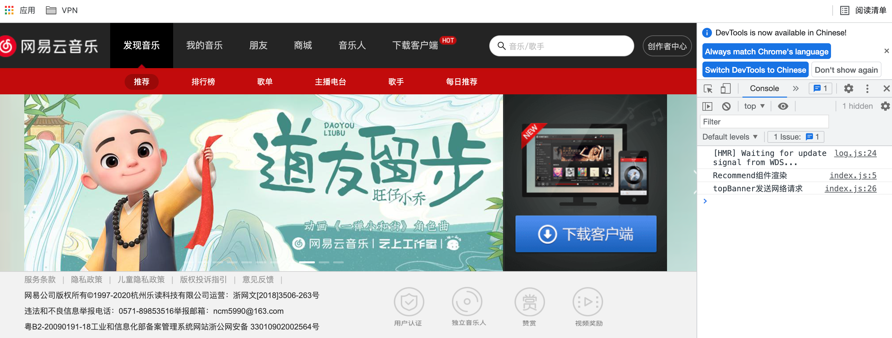
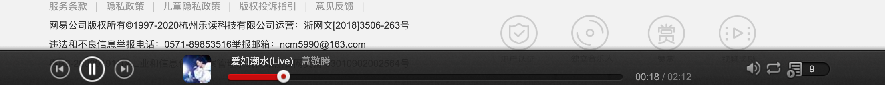
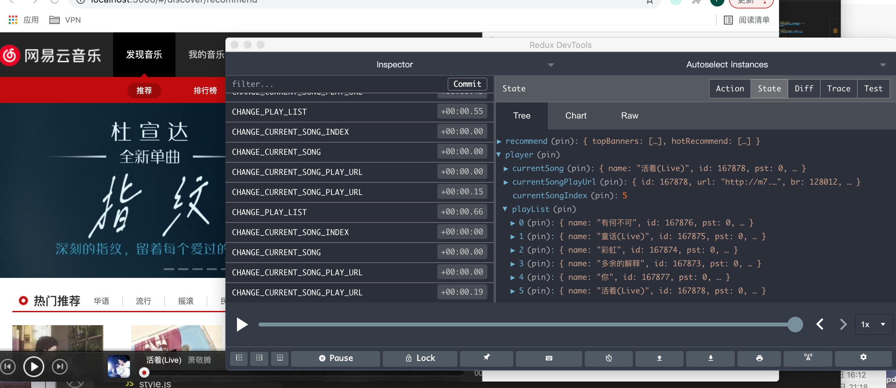
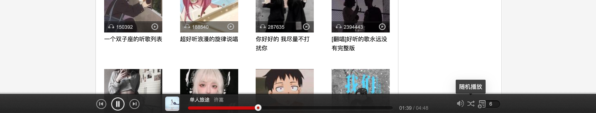
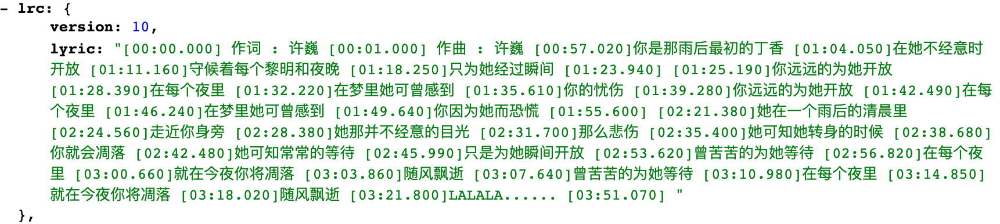
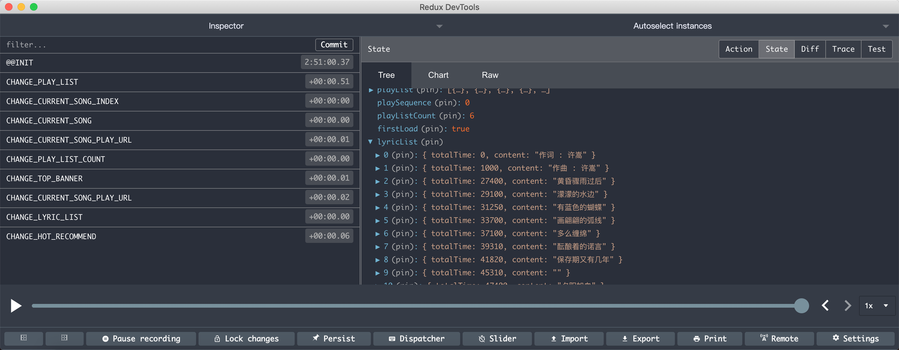
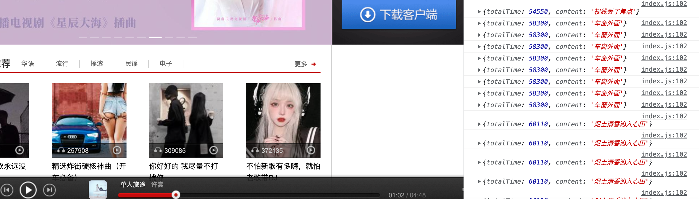
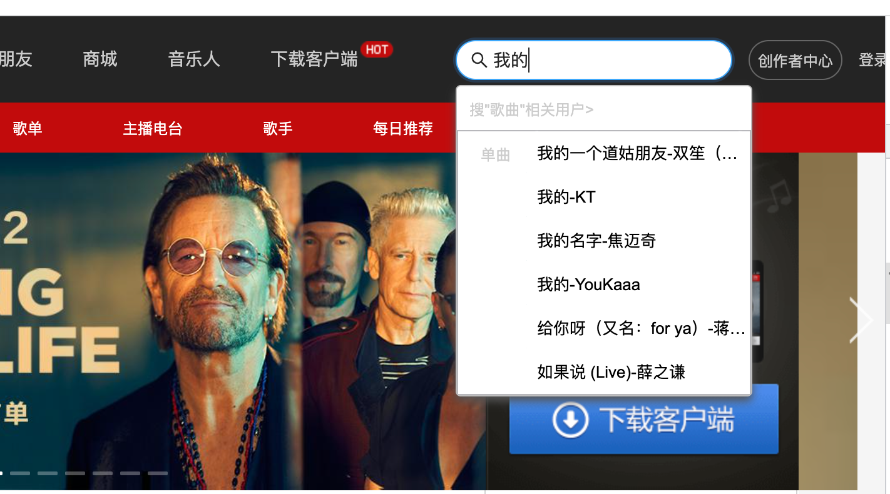

### 一、项目初始化

- 使用`create-react-app`脚手架初始化项目结构: `create-react-app music163_jr`

  底层基于webpack

- 目录结构

  ```
  │─src
    ├─assets 存放公共资源css和图片
      ├─css  全局css
      ├─img  
    ├─common  公共的一些常量
    ├─components 公共组件
    ├─pages   路由映射组件
    ├─router  前端路由配置
    ├─service 网络配置和请求
    └─store   全局的store配置
    └─utils   工具函数
    └─hooks   自定义hook
  ```

### 二、项目样式选择

- 样式重置

  normalize.css：对HTML元素几乎所有的默认样式进行重置，让所有的浏览器上对于未定义的样式浏览效果达到一致

  安装    `npm i -s  normalize.css`

- 项目资源

  放在src/assets/img/下，项目中使用到的精灵图和背景图

- 全局CSS文件

  src/assets/css/reset.css

  - 导入normalize.css
  - 定义精灵图背景（精灵图的类名是对应的图片文件名）

### 三、项目配置

使用craco（使用react手脚架搭建项目，webpack被封装）

- 对项目中 wepback 进行自定义配置
- 配置路径别名

1. 安装

   `npm i -s @craco/craco`

2. 修改`package.json`文件

   - 原本启动时，通过`react-scripts`来管理的；
   - 现在启动时，通过`craco`来管理；

   ```json
   "scripts": {
    "start": "react-scripts start",
    "build": "react-scripts build",
    "test": "react-scripts test",
   
    "start": "craco start",
    "build": "craco build",
    "test": "craco test",
   }
   ```

3. 在**根目录下**创建 `craco.config.js` 文件用于修改默认配置

   类似webpack.config.js

   - `module.exports = { // 配置文件 }`

   ```javascript
   // 根路径 -> craco.config.js
   const path = require('path')
   const resolve = dir => path.resolve(__dirname, dir)
   
   module.exports = {
     webpack: {
       alias: {
          // @映射src路径
         '@': resolve('src'),
         'components': resolve('src/components')
       }
     }
   }
   ```

### 四、组件划分

#### 1、header组件

- 状态：固定，不会随着URL发生变化
- 组件存放：src/components/app-header文件夹中


#### 2、footer组件

- 状态：固定，不会随着URL发生变化
- 组件存放：src/components/app-footer文件夹中


#### 3、main主体内容

- **状态**： **主体内容会是随着路径变化动态的发生改变的**

- 使用`router`动态渲染`path`对应的组件，具体配置如下

  - 前提： 在`src/pages`文件夹有创建`discover和mine和friend`组件

1. 安装`router`：`npm i -s react-router-dom`
2. 安装`react-router-config`(集中式配置路由映射):`npm i -s react-router-config`

```javascript
// src/router->index.js  (配置路由映射)
import Discover from "@/pages/discover";
import Mine from "@/pages/mine";
import Friend from "@/pages/friend";

const routes = [
  {
    path: "/discover",
    component: Discover    
  },
  {
    path: "/mine",
    component: Mine
  },
  {
    path: "/friend",
    component: Friend
  },
];

export default routes;
```

3. 在`App.js`使用`HashRouter`组件包裹使用`router-config`配置的路由映射（使路由映射表的配置生效):

```javascript
import {HashRouter} from 'react-router-dom';
import {renderRoutes} from 'react-router-config';
import routes from '@/router';
import AppHeader from 'components/app-header';
function App() {
  return (
    <div className="App">
      <HashRouter>
        <AppHeader />
        {renderRoutes(routes)}
      </HashRouter>
    </div>
  );
}

export default App;
```

- **验证路由是否配置成功**：在`header`组件中，使用`NavLink`测试路径切换，渲染对应组件

  

### 五、header组件实现

#### 1、头部组件样式编写

- 利用`styled-components`库选择CSS-IN-JS的解决方案

- 安装：`npm i -s styled-component`

- 布局使用`flex`

#### 2、头部区域划分

- 左导航 + 右其它


#### 3、头部区域实现(左)

```
实现功能：点击头部列表项，添加背景高亮和下面的小三角
实现思路：
- (利用`NavLink`组件的`activeClassName`单独设置样式)
- hot小图标在最后一个导航标签上添加伪元素实现
```

- 头部导航内容固定，存储在src/common/local-data.js中，以`headerLinks`数组形式导出

  ```javascript
  export const headerLinks = [
    {
      title: '发现音乐',
      link: '/discover', //点击router动态渲染组件
    },
    ...
   ]
  ```


#### 4、头部区域实现(右)

- 右侧使用`Antd`组件库实现
- 安装：`npm i -s antd`   `npm i -s @ant-design/icons`

```
1.在reset.css文件引入: antd样式 ↓
    @import '~antd/dist/antd.css';
2.在Header.js引入icons
3.使用antd组件: Input组件
4.修改placehold文本样式
```


### 六、footer组件实现

#### 1、底部区域布局


#### 2、实现效果


### 七、路由优化和API说明

#### 1、项目接口

- 本地安装部署，启动node服务，端口4000

- 官网有详细的接口文档说明   `https://binaryify.github.io/NeteaseCloudMusicApi/#/?id=接口文档`

  ```
  git clone https://github.com/Binaryify/NeteaseCloudMusicApi.git
  cd NeteaseCloudMusicApi
  npm install
  npm start // 启动服务
  ```

#### 2、路由优化_重定向

- 对'根路由'进行重定向到: `discover`页面

  ```javascript
  const routes = [
      ...
      {
          path: '/', 
          exact: true, 
          render: () => <Redirect to="/discover" /> 
      }
      // {
      //     path:"/",
      //     component:Discover
      // }
  
  ]
  ```

#### 3、嵌套路由

针对discover页面下的子导航栏

- 创建discover文件夹下的子组件

  

- 配置"嵌套路由映射表"

  ```javascript
  const routes = [
      {
          path:"/discover",
          component:Discover,
          routes:[
              { path: '/discover', exact:true, render: () => <Redirect to="/discover/recommend"/>},
              { path: '/discover/recommend', component: Recommend },
              { path: '/discover/ranking', component: Ranking },
              { path: '/discover/album', component: Album },
              { path: '/discover/djradio', component: Djradio },
              { path: '/discover/artist', component: Artist },
              { path: '/discover/song', component: Song }
          ]
      },
      ...
  ]   
  ```

- 渲染嵌套子路由config

  - 子导航栏的实现

    - components下编写nav-bar组件，数据存储在local-data.js中
    - `discover`组件中引入`navbar`组件

    

  - 在`discover`页面下渲染嵌套子路由

    ```javascript
    import {renderRoutes} from 'react-router-config';
    import NavBar from 'components/nav-bar';
    
    function Discover(props){
        return (
            <div>
                <NavBar />
                {renderRoutes(props.routes)}
            </div>
        );
    }
    
    export default Discover;
    ```

#### 4、轮播图API

- 发送网络请求使用`axios`

- 安装axios:`npm i -s axios`

- 二次封装axios

  - api统一管理，容易维护

  - 放在src/service下

  - 简易版

    ```javascript
    import axios from 'axios'
    import { BASE_URL, TIMEOUT } from './config'
    
    const instance = axios.create({
      // 默认的配置
      baseURL: BASE_URL, // -> http://123.57.176.198:3000/banner
      timeout: TIMEOUT, // -> 5000
      headers: {}
    })
    
    instance.interceptors.request.use(
      // 请求拦截
      (config) => {
        return config
      },
      (err) => {}
    )
    
    instance.interceptors.response.use(
      // 响应拦截
      (res) => {
        return res.data
      },
      (err) => {
        if (err && err.response) {
          switch (err.response.status) {
            case 400:
              console.log('请求错误')
              break
            case 401:
              console.log('未授权访问')
              break
            default:
              console.log('其他错误信息')
          }
        }
        return err
      }
    )
    
    export default instance
    ```

- 轮播图数据请求举例

  URL：http://localhost:4000/banner

### 八、redux保存服务器返回的数据

#### 1、安装redux

- 安装   `npm i -s redux react-redux redux-thunk`

#### 2、配置redux

- 项目根目录src下的store → reducer.js

  ```javascript
  import { combineReducers } from "redux";
  // 引入recommend页面的store
  import { reducer as recommendReducer } from '@/pages/discover/child-pages/recommend/store'
  
  // 将多个reducer合并
  const cReducer = combineReducers({
    recommend: recommendReducer
  })
  export default cReducer
  ```

- 项目根src下store → index.js

  ```javascript
  import { createStore,applyMiddleware } from "redux";
  
  // 引入thunk中间件(可以让派发的action可以是一个函数)
  import thunk from 'redux-thunk'
  
  // 引入合并后的reducer
  import cReducer from "./reducer";
  
  // 创建store并传递
  const store = createStore(cReducer,applyMiddleware(thunk))
  
  export default store
  ```

- 项目根src目录下app.js文件中 → 配置react-redux

  ```javascript
  import {HashRouter} from 'react-router-dom';
  import {renderRoutes} from 'react-router-config';
  import routes from '@/router';
  import AppHeader from 'components/app-header';
  import AppFooter from 'components/app-footer';
  
  import {Provider} from 'react-redux';
  import store from './store';
  
  function App() {
    return (
      <Provider store={store}>
        <HashRouter>
          <AppHeader />
          {/* Router路由映射，动态渲染组件 */}
          {renderRoutes(routes)}
          <AppFooter />
        </HashRouter>
      </Provider>
    );
  }
  
  export default App;
  ```

- 总结

  - 异步操作交给中间件实现，将action拦截下来完成一些操作后再交给store

    中间件是个函数，核心是对数据进行操作

  - thunk——中间件（工具包），里面完成异步行为（发送请求加载数据等）
  
    使用了thunk，action里面可以返回一个函数，而不一定是对象{type:,payload}

#### 3、轮播图数据通过redux-thunk来请求

- src->page->discover->child-pages->recommend->store->actionCreator.js (派发action用的)

  ```javascript
  import * as actionTypes from './actionTypes';
  import {getTopBanners} from '@/service/recommend';
  
  // 轮播图Action
  export const changeTopBannerAction = res => ({
      type: actionTypes.CHANGE_TOP_BANNER,
      topBanners: res,
  })
  
  // 轮播图网络请求
  export const getTopBannersAction = () => {
      return dispatch => {
        // 发送网络请求
          getTopBanners().then(res => {
              dispatch(changeTopBannerAction(res))
          })
      }
  }
  ```

- src/service->recommend.js-----------推荐页的轮播图API接口

  ```javascript
  import request from './request';
  
  // 轮播图
  export function getTopBanners() {
      return request({
        url: "/banner"
      })
  }
  ```

- src/page->dicover->child-pages->recommend/index.js

  ```javascript
  import {getTopBannersAction} from './store/actionCreator';
  import {bindActionCreators} from 'redux';
  import {connect} from 'react-redux';
  import {Component} from 'react'
  
  class Recommend extends Component{
  
      render(){
          console.log('渲染组件Recommend');
          return (
              <div>
                  <div>recommend</div>
                  <div>{this.props.topBanners.length}</div>
              </div>
          );
      }
  
      componentDidMount(){
          console.log('Recommend组件挂载完成了');
          this.props.getTopBannersAction();
      }
  
  
  }
  
  // function Recommend(props){
  //     console.log(props.topBanners);
  //     return (
  //         <div>
  //             <div>recommend</div>
  //             <div>{props.topBanners.length}</div>
  //             <button onClick={props.getTopBannersAction}>获取轮播图</button>
  //         </div>
  //     );
  // }
  
  // 从state中取数据映射到props上
  const mapStateToProps = (state) => ({
      topBanners:state.recommend.topBanners
  })
  
  const mapDispatchToProps = (dispatch)=>(bindActionCreators({getTopBannersAction},dispatch))
  
  export default connect(mapStateToProps,mapDispatchToProps)(Recommend);
  ```

- 效果

  

#### 【坑一】

不小心写了个死循环，在render里直接 `this.props.getTopBannersAction();`，数据更新触发render，render里再次数据更新

初次数据请求放在生命周期函数 `componentDidMount`里

#### 【组件内状态使用react hook实现】

#### 【使用useSelector、useDispatch替代connect】

- redux 产生的原因是因为不同组件需要实现 state 共享，全部存储在store中统一管理，便于组件间通信
- 有些场景不必使用到redux
- hooks在函数组件中引入类组件中的状态和生命周期，复用组件逻辑
- https://www.cnblogs.com/hymenhan/archive/2021/04/28/14711516.html

#### 4、useSelector性能优化

```javascript
		const { topBanners } = useSelector(
        state => ({
            topBanners:state.recommend.topBanners
        }),
        shallowEqual
    )
```

- store中的state发生变化，会触发useSelector
- useSelector函数默认与前一次调用中返回的`state`对象进行一次引用对比（===）。因为每次调用函数的时候, 创建的对象都是一个全新对象，所以每次只要`store中的state`发生了改变, 不管当前组件的依赖值是否变化，都会重新渲染
- shallowEqual：比较时进行值比较


### 九、推荐页banner

#### 1、轮播图区域布局



#### 2、轮播图采用antd走马灯组件

```javascript
import React, { useEffect, useRef, useState } from 'react';
import { shallowEqual, useDispatch, useSelector } from 'react-redux';
import { getTopBannersAction } from '../../store/actionCreator'
import {BannerWrapper,BannerLeft,BannerRight,BannerControl} from './style';
import {Carousel} from 'antd';

function TopBanners(){
    console.log('TopBanner组件渲染了');

    // 组件内state
    const [currentIndex, setCurrentIndex] = useState(0)

    // redux Hook 组件和redux关联: 获取数据和进行操作
    const dispatch = useDispatch()
    const { topBanners } = useSelector(
        state => ({
            topBanners:state.recommend.topBanners
        }),
        shallowEqual
    )

    const bannerRef = useRef()

    useEffect(() => {
        // 在组件挂载之后发送网络请求
        dispatch(getTopBannersAction())
    },[dispatch])
    
    const bgImage =
    topBanners &&
    topBanners[currentIndex] &&
    topBanners[currentIndex].imageUrl + '?imageView&blur=40x20'

    return (
        <BannerWrapper bgImage={bgImage}>
            <div className='content'>
                <BannerLeft>
                    <Carousel
                        effect="fade"
                        autoplay={true}
                        ref={bannerRef}
                        beforeChange={(from, to) => {setCurrentIndex(to)}}
                    >
                        {topBanners && topBanners.map((item)=>(
                            <div key={item.imageUrl}>
                                
                            </div>
                        ))}
                    </Carousel>
                </BannerLeft>
                <BannerRight/>
                <BannerControl>
                    <button className="btn" onClick={() => bannerRef.current.prev()}></button>
                    <button className="btn" onClick={() => bannerRef.current.next()}></button>
                </BannerControl>
            </div>
        </BannerWrapper>
    );
}

export default TopBanners;
```

#### 3、 背景高斯模糊实现



### 十、推荐页主体布局


- 样式实现
  - 复用头部组件
  - 父子组件之间props传头部数据
  - 在头部组件中对参数设置要求（title必传）


#### 【注意点】

- 使用useSeclector，reducer里修改state，是替换，不是合并

- useSelector性能优化，组件依赖数据不变时不重复渲染

  

#### 1、组件需要发送网络请求的基本步骤

- 网络请求接口封装 src/service/recommend.js

  ```javascript
  // 热门推荐 8条
  export function getHotRecommend(){
    return  request({
      url:'/personalized?limit=8'
    })
  }
  ```

- 修改reducer，添加数据以及action处理函数

  ```javascript
  import * as actionTypes from './actionTypes'
  
  const defaultState = {
      topBanners: [],
      hotRecommend:[]
  }
  
  function reducer(state = defaultState, action){
      switch (action.type) {
          case actionTypes.CHANGE_TOP_BANNER:
              return {
                  ...state,
                  topBanners:action.topBanners.banners
              }
          case actionTypes.CHANGE_HOT_RECOMMEND:
              return {
                  ...state,
                  hotRecommend: action.hotRecommend.result
              }
          default:
              return state
          
      }
  }
  
  export default reducer;
  ```

- 在actionCreator文件中发送网络请求、生成对应action

  ```javascript
  import * as actionTypes from './actionTypes';
  import {getTopBanners,getHotRecommend} from '@/service/recommend';
  
  // 轮播图Action
  export const changeTopBannerAction = res => ({
      type: actionTypes.CHANGE_TOP_BANNER,
      topBanners: res,
  })
  
  // 轮播图网络请求
  export const getTopBannersAction = () => {
      return dispatch => {
        // 发送网络请求
          getTopBanners().then(res => {
              dispatch(changeTopBannerAction(res))
          })
      }
  }
  
  // 热门推荐Action
  export const changeHotRecommendAction = res => ({
      type: actionTypes.CHANGE_HOT_RECOMMEND,
      hotRecommend:res
  })
  
  // 热门推荐网络请求
  export const getHotRecommendAction = ()=>{
      return dispatch => {
          getHotRecommend().then(res => {
              dispatch(changeHotRecommendAction(res))
          })
      }
  }
  ```

- 在组件中使用useSelector展示数据

  ```javascript
  function HotRecommend(){
      // console.log('HotRecommend组件渲染');
  
      // 从store中获取数据
      const {hotRecommend} = useSelector(state => ({
          hotRecommend:state.recommend.hotRecommend
      }),shallowEqual)
  
      const dispatch = useDispatch();
      // 网络请求数据
      useEffect(() => {
          console.log('HotRecommend组件发送网络请求');
          dispatch(getHotRecommendAction());
      }, [dispatch])
  
      return (
          <HotRecommendWrapper>
              <ThemeHeaderRmc 
                  title="热门推荐"
                  keywords={['华语', '流行', '摇滚', '民谣', '电子']}
              />
              <div className="recommend-list">
                  {
                      hotRecommend &&
                      hotRecommend.map((item) => (
                          <SongCover key={item.id} info={item} className='item'/>
                      ))
                  }
              </div>
          </HotRecommendWrapper>
      );
  }
  
  export default HotRecommend;
  ```

  

#### 2、实现效果

外层包裹div, 并使用flex布局, flex-wrap换行


### 十一、音乐播放组件

#### 1、样式实现

- 进度条和文字提示使用了antd组件库中的Slider组件和tooltips组件

- 主体分三部分，最外层flex布局，三部分内部也用flex布局实现

  ```
  PlayBar组件布局采用固定定位: 
  PlayerWrapper↓
   	内容(content)分了三个部分:↓
   		1)Control(左侧)
   			三个按钮.添加背景图,外层采用flex布局
   		2)PlayIInfo(中间)
   		3)Opertaor(右侧)
   			两部分,外层采用flex布局
  ```

  


#### 2、歌曲详情播放数据请求

- 先固定播放一首歌，固定查询ids

  http://localhost:4000/song/detail?ids=167874

- 实现步骤

  - 1、网络请求 service/player.js

    ```javascript
    import request from './request';
    
    export function getSongDetail(ids){
        return request({
            url:'/song/detail',
            params:{
                ids
            }
        });
    }
    ```

  - 2、创建对应store——/pages/player/store

    - actionTypes.js 定义常量

      ```javascript
      export const CHANGE_CURRENT_SONG = 'CHANGE_CURRENT_SONG'
      ```

    - reducer.js 定义数据与action处理函数

      ```javascript
      import * as actionTypes from './actionTypes';
      
      const defaultState = {
          currentSong: {}
      }
      
      function reducer(state=defaultState,action){
          switch(action.type){
              case actionTypes.CHANGE_CURRENT_SONG:
                  return {
                      ...state,
                      currentSong:action.currentSong
                  };
              default:
                  return state;
          }
      }
      
      export default reducer;
      ```

      - 创建action

      ```javascript
      import * as actionTypes from './actionTypes';
      import {getSongDetail} from '@/service/player';
      
      // 歌曲详情Action
      const changeCurrentSongAction = res =>({
              type:actionTypes.CHANGE_CURRENT_SONG,
              currentSong:res
          })
      
      export const getSongDetailAction = id =>{
          return dispatch => {
              getSongDetail(id).then(res => {
                  dispatch(changeCurrentSongAction(res));
              });
          }
      }
      ```

  - 3、在player/app-player-bar/index.js里引用actionCreator中的方法发送请求、关联数据

  - 4、更改组件的固定数据

    ```javascript
     currentSong.al.picUrl   图片
     currentSong.name 		歌曲名字
     currentSong.ar[0].name  作者
     currentSong.dt  (歌曲总时长,格式化)
     导入时间格式化工具(转换时间格式)
     formatDate(duration, "mm:ss")
    ```


#### 3、音乐播放

- 歌曲详情页拿不到音乐播放的URL，需要根据ID二次获取

  -  歌曲详情API  `/song/detail?ids=167874`

  - 音乐播放url    `song/url?id=167874`

  - 根据请求下来`当前歌曲(currentSong)`获取当前歌曲`id`信息，再去请求播放URL

    ```javascript
        /***** 设置音频src ****/
        useEffect(()=>{
            console.log('设置音频******');
            if(currentSong.id){
                dispatch(getSongPlayUrlAction(currentSong.id));
            }
        },[currentSong]);// eslint-disable-line react-hooks/exhaustive-deps
    ```

- 音乐播放逻辑

  ```
  step1 
    	添加 audio 标签，设置src
    	添加click事件，点击切换audio播放/暂停状态
    	
  ```

- 实现效果

  

#### 4、音乐播放与滑动条联动

- audio标签音乐播放时触发 timeUpdate，更新currentTime和progress
- 滑动滑块时触发sliderChange，更新currentTime和progress。若歌曲在播放，则此时有两个函数对这两个变量更改，故设置isChanging变量，控制某时只有一个函数可更改
- 手指抬起时触发slideAfterChange，【注意】设置重新获取slider的value，对audio的currentTime设置

```javascript
/***** 音乐播放时更新歌曲播放时间currentTime、slider进程 ****/
    function timeUpdate(e){
        // console.log(e.target.currentTime);
        let currentTime = e.target.currentTime;
        if(!isChanging){
            console.log('音乐播放时更新歌曲播放时间currentTime、slider进程');
            setCurrentTime(currentTime*1000);
            setProgress(((currentTime * 1000) / duration) * 100);   
        }     
    }

    /***** 滑动滑块时触发 ****/
    function sliderChange(value){
        console.log('滑动滑块时更新currentTime、slider进程');
        setIsChanging(true);
        const currentTime = (value / 100) * duration;
        setCurrentTime(currentTime);
        setProgress(value);

    }
    /***** 手指抬起时触发 ****/
    function slideAfterChange(value){
        console.log('手指抬起时更新audio的currentTime');
        setIsChanging(false);
        const currentTime = ((value / 100) * duration) / 1000;
        audioRef.current.currentTime = currentTime;
    }
```


```
progress进度: 1-100
currentTime: 要的是毫秒数
audioRef.current.currentTime: 要的是总秒数
```

#### 5、歌曲播放功能完善

- 新增功能

  - 切换列表播放顺序：随机播放/顺序播放
  - 点击左右按钮根据指定顺序播放歌曲

- 新增字段

  - currentSongIndex 当前播放音乐的索引
  - playList  播放列表
  - playSequence 播放顺序
  - playListCount 播放列表数量

- 请求歌曲详情逻辑

  ```javascript
  export const getSongDetailAction = (id) =>{
      return (dispatch,getState) => {
          // 1、根据id查找palyList里是否有该歌曲
          const playList = getState().player.playList;
          const songIndex = playList.findIndex(song => song.id===id);
          
          if(songIndex !== -1){
              // 2、找到歌曲
              dispatch(changeSongIndexAction(songIndex));
              dispatch(changeCurrentSongAction(playList[songIndex]));
              dispatch(changeCurrentSongPlayUrlAction(id));
  
          }else{
              // 3、没找到歌曲
              // 请求数据
              getSongDetail(id).then(res => {
                  const song = res.songs && res.songs[0];
                  playList.push(song);
                  // (1)添加到播放列表中
                  dispatch(changePlayListAction(playList));
                  let songIndex = playList.length-1;
                  // (2)更改当前播放的索引
                  dispatch(changeSongIndexAction(songIndex));
                  // (3)更改当前播放歌曲
                  dispatch(changeCurrentSongAction(playList[songIndex]));
                  // (4)更改当前播放歌曲url
                  dispatch(changeCurrentSongPlayUrlAction(id));
                  // (5)更新歌曲数量
                  dispatch(changePlayListCount(playList.length));
              });
  
          }
      }
  }
  ```

- 改变播放顺序

  ```javascript
  // 更改播放顺序Action
  export const changePlaySequenceAction = (res) => ({
      type: actionTypes.CHANGE_PLAY_SEQUENCE,
      playSequence:res
  })
  ```

- 点击按钮切换歌曲

  ```javascript
  // 切换歌曲Action
  export const changeCurrentIndexAndSongAction = (tag) =>{
      return (dispatch,getState) => {
          // 根据playSequence决定是顺序播放还是随机播放
          const playSequence = getState().player.playSequence;
          // 播放列表
          const playList = getState().player.playList;
          // 当前播放的索引/下标
          let currentSongIndex = getState().player.currentSongIndex;
  
          // 根据播放顺序选择下一首音乐
          switch(playSequence){
              case 1: 
                  // 随机播放
                  let random = getRandomNumber(playList.length)
                  while (random === currentSongIndex) {
                      random = getRandomNumber(playList.length)
                  }
                  // 更改当前播放音乐的下标
                  currentSongIndex = random
                  break;
              default:
                  // 顺序播放
                  currentSongIndex += tag
                  // 判断当前音乐的下标是否超出播放列表长度
                  if (currentSongIndex >= playList.length) currentSongIndex = 0;
                  if (currentSongIndex < 0) currentSongIndex = playList.length - 1;
          }
          // 获取需要播放的音乐
          const song = playList[currentSongIndex];
          // 更改当前播放的音乐
          dispatch(changeCurrentSongAction(song));
          dispatch(changeSongIndexAction(currentSongIndex))
          dispatch(changeCurrentSongPlayUrlAction(song.id));
      }
  }
  ```

- 实现效果

  

  

  


#### 6、歌词显示

- 歌词数据接口API   `http://localhost:4000/lyric?id=167876`

  

- 歌词请求时机

  - 组件渲染完/切换歌曲

- 歌词解析

   封装歌词解析工具函数(逻辑思路)

   ```javascript
   1.使用slice切割字符串
   2.创建正则解析规则: 将"[00:26.810]傻站在你家楼下..."  解析成->  00:26.810 
   3.注意: 最后一行也有\n在遍历时加个判断,如果为不为空执行下面操作
   4.获取正则解析的3个时间转换为毫秒, 分钟:秒数:00*10 000就是毫秒(加个判断*1转换为number类型)
   5.将获取的3个毫秒数相加: 当前歌曲播放的总时长(毫秒)
   6.获取当前播放的歌词: replace方法 (完成效果如下👇)
     [
       0: {totalTime: 0, content: "作曲 : 许嵩"}
       1: {totalTime: 1000, content: "作词 : 许嵩"}
       2: {totalTime: 22240, content: "天空好想下雨"}
       3: {totalTime: 24380, content: "我好想住你隔壁"}
     ]
   7.将数据保存到redux当中
   8.注意: 在切换歌曲时有可能会报 Cannot read property '1' of null , 这是因为从result读取属性时没找到, 加一个if判断,如果result没有值的话, 执行关键字continue跳转到判断条件重新执行
   ```

   歌词解析代码

   ```javascript
   const parseExp = /\[([0-9]{2}):([0-9]{2})\.([0-9]{2,3})\]/
   export function parseLyric(lyrics) {
     if(!lyrics) return
     const lineStrings = lyrics.split('\n')
     const lyricList = []
     for (const line of lineStrings) {
       if (line) {
         const result = parseExp.exec(line)
         if(!result) continue
         const time1 = result[1] * 60 * 1000
         const time2 = result[2] * 1000
         const time3 = result[3].length > 2 ? result[3] * 1 : result[3] * 1000
         // 当前歌曲播放的总时长(毫秒)
         const totalTime = time1 + time2 + time3
         const content = line.replace(parseExp, '').trim()
         const lineObj = {totalTime, content};
         lyricList.push(lineObj)
       }
     }
     return lyricList
   }
   ```

- 解析结果存储在 lyricList中

   

- 找到当前时刻对应的歌词

   在函数`timeUpdate`里处理

   - 当前播放时间小于歌词时间，退出循环，取前一句歌词
   - 更改当前歌词索引时进行判断，避免不必要的dispatch

   ```javascript
    	function timeUpdate(e){
           let currentTime = e.target.currentTime;
           if(!isChanging){
               // console.log('音乐播放时更新歌曲播放时间currentTime、slider进程');
               setCurrentTime(currentTime*1000);
               setProgress(((currentTime * 1000) / duration) * 100);   
           }     
   
           // 获取当前播放歌词
           let i = 0; //用于获取歌词的索引
           for (; i < lyricList.length; i++){
               if (currentTime * 1000 < lyricList[i].totalTime) {
                   break;
               }
           }
           // 如果index没有改变,就不进行dispatch(对dispatch进行优化)
           if (currentLyricIndex !== i - 1) {
               dispatch(changeCurrentLyricIndexAction(i - 1));
           }
           console.log(lyricList[i-1]);
       }
   ```

   

   

- 展示歌词

   - 使用`Antd Message`组件
   - `Message`组件的开启和销毁
     - 和isPlaying相关联，当isPlaying为false时销毁，isPlaying为true时开启
   - 实现效果
   
   


### 十二、搜索栏实现

#### 1、发送网络请求

- service/theme-header.js封装网络请求

  ```javascript
  import request from './request';
  
  export function getSearchSongData(keywords,limit=6,type=1){
      return request({
          url:'/search',
          params:{
              keywords,
              limit,
              type
          }
      });
  }
  ```

- 创建reducer和actionCreators

  ```javascript
  // reducer.js
  const defaultState = {
      searchSongList: [],
      focusState: false
  };
  ```

#### 2、定义Input组件的事件处理函数

- 使用`useCallback`定义

  - 问题——组件重新 render 之后所有的事件处理函数重新全部定义, 非常浪费性能
  - 解决: 当**依赖的属性没有改变时**, 不希望更新 render 时, **重新定义事件函数**
  - 目标：为了进行性能的优化
    - `useCallBack`会返回一个函数 `memoized`(记忆的) 值
    - 在依赖不变的情况下, 多定义的时候, 返回值是相同的

- onChange

  - 功能：发送网络请求

  - 实现效果

    

- onFouces

  - 功能：显示/隐藏下拉框
  - 

- onInput

  


项目难点：底部音乐播放器实现

- 逻辑
- 优化


加载性能

渲染次数

数据存储/更新

内存占有


