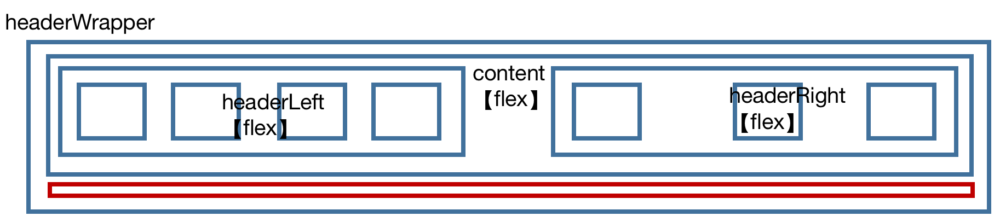
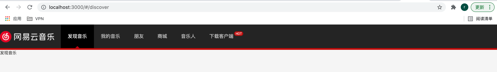
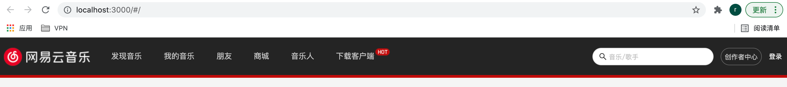
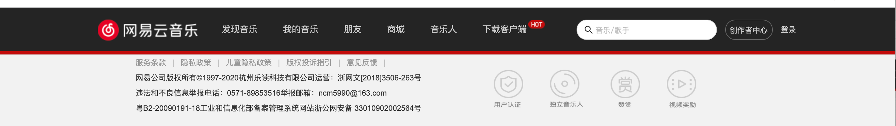
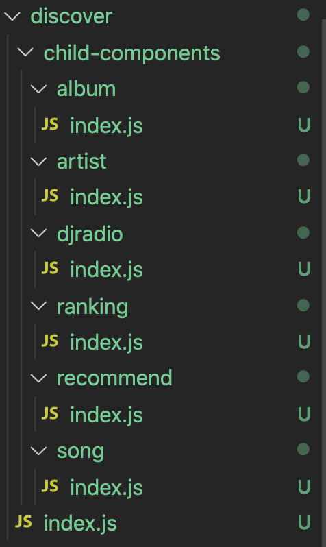
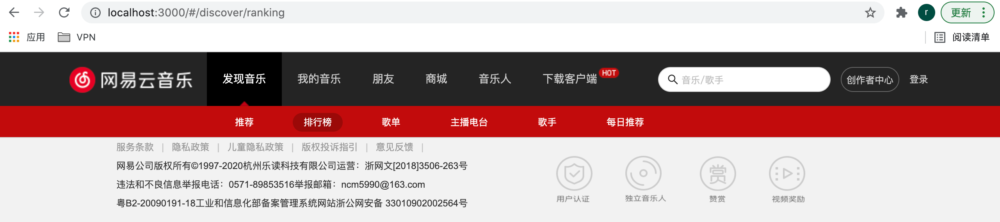
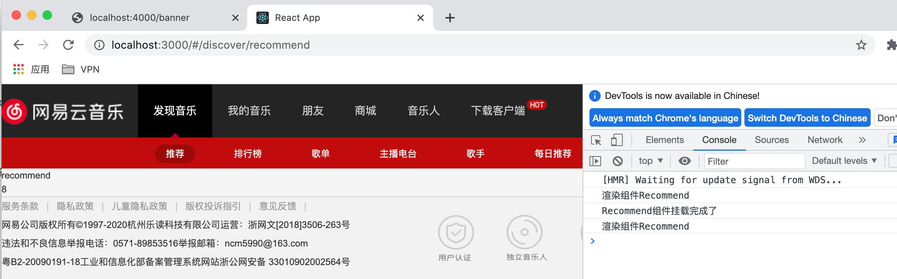

### 一、项目初始化

- 使用`create-react-app`脚手架初始化项目结构: `create-react-app music163_jr`

  底层基于webpack

- 目录结构

  ```
  │─src
    ├─assets 存放公共资源css和图片
      ├─css  全局css
      ├─img  
    ├─common  公共的一些常量
    ├─components 公共组件
    ├─pages   路由映射组件
    ├─router  前端路由配置
    ├─service 网络配置和请求
    └─store   全局的store配置
    └─utils   工具函数
    └─hooks   自定义hook
  ```

### 二、项目样式选择

- 样式重置

  normalize.css：对HTML元素几乎所有的默认样式进行重置，让所有的浏览器上对于未定义的样式浏览效果达到一致

  安装    `npm i -s  normalize.css`

- 项目资源

  放在src/assets/img/下，项目中使用到的精灵图和背景图

- 全局CSS文件

  src/assets/css/reset.css

  - 导入normalize.css
  - 定义精灵图背景（精灵图的类名是对应的图片文件名）

### 三、项目配置

使用craco（使用react手脚架搭建项目，webpack被封装）

- 对项目中 wepback 进行自定义配置
- 配置路径别名

1. 安装

   `npm i -s @craco/craco`

2. 修改`package.json`文件

   - 原本启动时，通过`react-scripts`来管理的；
   - 现在启动时，通过`craco`来管理；

   ```json
   "scripts": {
   -"start": "react-scripts start",
   -"build": "react-scripts build",
   -"test": "react-scripts test",
   
   \+ "start": "craco start",
   \+ "build": "craco build",
   \+ "test": "craco test",
   }
   ```

3. 在**根目录下**创建 `craco.config.js` 文件用于修改默认配置

   类似webpack.config.js

   - `module.exports = { // 配置文件 }`

   ```javascript
   // 根路径 -> craco.config.js
   const path = require('path')
   const resolve = dir => path.resolve(__dirname, dir)
   
   module.exports = {
     webpack: {
       alias: {
          // @映射src路径
         '@': resolve('src'),
         'components': resolve('src/components')
       }
     }
   }
   ```

### 四、组件划分

#### 1、header组件

- 状态：固定，不会随着URL发生变化
- 组件存放：src/components/app-header文件夹中


#### 2、footer组件

- 状态：固定，不会随着URL发生变化
- 组件存放：src/components/app-footer文件夹中


#### 3、main主体内容

- **状态**： **主体内容会是随着路径变化动态的发生改变的**

- 使用`router`动态渲染`path`对应的组件，具体配置如下

  - 前提： 在`src/pages`文件夹有创建`discover和mine和friend`组件

1. 安装`router`：`npm i -s react-router-dom`
2. 安装`react-router-config`(集中式配置路由映射):`npm i -s react-router-config`

```javascript
// src/router->index.js  (配置路由映射)
import Discover from "@/pages/discover";
import Mine from "@/pages/mine";
import Friend from "@/pages/friend";

const routes = [
  {
    path: "/discover",
    component: Discover    
  },
  {
    path: "/mine",
    component: Mine
  },
  {
    path: "/friend",
    component: Friend
  },
];

export default routes;
```

3. 在`App.js`使用`HashRouter`组件包裹使用`router-config`配置的路由映射（使路由映射表的配置生效):

```javascript
import {HashRouter} from 'react-router-dom';
import {renderRoutes} from 'react-router-config';
import routes from '@/router';
import AppHeader from 'components/app-header';
function App() {
  return (
    <div className="App">
      <HashRouter>
        <AppHeader />
        {renderRoutes(routes)}
      </HashRouter>
    </div>
  );
}

export default App;
```

- **验证路由是否配置成功**：在`header`组件中，使用`NavLink`测试路径切换，渲染对应组件

  

### 五、header组件实现

#### 1、头部组件样式编写

- 利用`styled-components`库选择CSS-IN-JS的解决方案

- 安装：`npm i -s styled-component`

- 布局使用`flex`

#### 2、头部区域划分

- 左导航 + 右其它




#### 3、头部区域实现(左)

```
实现功能：点击头部列表项，添加背景高亮和下面的小三角
实现思路：
- (利用`NavLink`组件的`activeClassName`单独设置样式)
- hot小图标在最后一个导航标签上添加伪元素实现
```

- 头部导航内容固定，存储在src/common/local-data.js中，以`headerLinks`数组形式导出

  ```javascript
  export const headerLinks = [
    {
      title: '发现音乐',
      link: '/discover', //点击router动态渲染组件
    },
    ...
   ]
  ```



#### 4、头部区域实现(右)

- 右侧使用`Antd`组件库实现
- 安装：`npm i -s antd`   `npm i -s @ant-design/icons`

```
1.在reset.css文件引入: antd样式 ↓
    @import '~antd/dist/antd.css';
2.在Header.js引入icons
3.使用antd组件: Input组件
4.修改placehold文本样式
```



### 六、footer组件实现

#### 1、底部区域布局


#### 2、实现效果



### 七、路由优化和API说明

#### 1、项目接口

- 本地安装部署，启动node服务，端口4000

- 官网有详细的接口文档说明   `https://binaryify.github.io/NeteaseCloudMusicApi/#/?id=接口文档`

  ```
  git clone https://github.com/Binaryify/NeteaseCloudMusicApi.git
  cd NeteaseCloudMusicApi
  npm install
  npm start // 启动服务
  ```

#### 2、路由优化_重定向

- 对'根路由'进行重定向到: `discover`页面

  ```javascript
  const routes = [
      ...
      {
          path: '/', 
          exact: true, 
          render: () => <Redirect to="/discover" /> 
      }
      // {
      //     path:"/",
      //     component:Discover
      // }
  
  ]
  ```

#### 3、嵌套路由

针对discover页面下的子导航栏

- 创建discover文件夹下的子组件

  

- 配置"嵌套路由映射表"

  ```javascript
  const routes = [
      {
          path:"/discover",
          component:Discover,
          routes:[
              { path: '/discover', exact:true, render: () => <Redirect to="/discover/recommend"/>},
              { path: '/discover/recommend', component: Recommend },
              { path: '/discover/ranking', component: Ranking },
              { path: '/discover/album', component: Album },
              { path: '/discover/djradio', component: Djradio },
              { path: '/discover/artist', component: Artist },
              { path: '/discover/song', component: Song }
          ]
      },
      ...
  ]   
  ```

- 渲染嵌套子路由config

  - 子导航栏的实现

    - components下编写nav-bar组件，数据存储在local-data.js中
    - `discover`组件中引入`navbar`组件

    

  - 在`discover`页面下渲染嵌套子路由

    ```javascript
    import {renderRoutes} from 'react-router-config';
    import NavBar from 'components/nav-bar';
    
    function Discover(props){
        return (
            <div>
                <NavBar />
                {renderRoutes(props.routes)}
            </div>
        );
    }
    
    export default Discover;
    ```

#### 4、轮播图API

- 发送网络请求使用`axios`

- 安装axios:`npm i -s axios`

- 二次封装axios

  - api统一管理，容易维护

  - 放在src/service下

  - 简易版

    ```javascript
    import axios from 'axios'
    import { BASE_URL, TIMEOUT } from './config'
    
    const instance = axios.create({
      // 默认的配置
      baseURL: BASE_URL, // -> http://123.57.176.198:3000/banner
      timeout: TIMEOUT, // -> 5000
      headers: {}
    })
    
    instance.interceptors.request.use(
      // 请求拦截
      (config) => {
        return config
      },
      (err) => {}
    )
    
    instance.interceptors.response.use(
      // 响应拦截
      (res) => {
        return res.data
      },
      (err) => {
        if (err && err.response) {
          switch (err.response.status) {
            case 400:
              console.log('请求错误')
              break
            case 401:
              console.log('未授权访问')
              break
            default:
              console.log('其他错误信息')
          }
        }
        return err
      }
    )
    
    export default instance
    ```

- 轮播图数据请求举例

  URL：http://localhost:4000/banner

### 八、redux保存服务器返回的数据

#### 1、安装redux

- 安装   `npm i -s redux react-redux redux-thunk`

#### 2、配置redux

- 项目根目录src下的store → reducer.js

  ```javascript
  import { combineReducers } from "redux";
  // 引入recommend页面的store
  import { reducer as recommendReducer } from '@/pages/discover/child-pages/recommend/store'
  
  // 将多个reducer合并
  const cReducer = combineReducers({
    recommend: recommendReducer
  })
  export default cReducer
  ```

- 项目根src下store → index.js

  ```javascript
  import { createStore,applyMiddleware } from "redux";
  
  // 引入thunk中间件(可以让派发的action可以是一个函数)
  import thunk from 'redux-thunk'
  
  // 引入合并后的reducer
  import cReducer from "./reducer";
  
  // 创建store并传递
  const store = createStore(cReducer,applyMiddleware(thunk))
  
  export default store
  ```

- 项目根src目录下app.js文件中 → 配置react-redux

  ```javascript
  import {HashRouter} from 'react-router-dom';
  import {renderRoutes} from 'react-router-config';
  import routes from '@/router';
  import AppHeader from 'components/app-header';
  import AppFooter from 'components/app-footer';
  
  import {Provider} from 'react-redux';
  import store from './store';
  
  function App() {
    return (
      <Provider store={store}>
        <HashRouter>
          <AppHeader />
          {/* Router路由映射，动态渲染组件 */}
          {renderRoutes(routes)}
          <AppFooter />
        </HashRouter>
      </Provider>
    );
  }
  
  export default App;
  ```

- 总结

  - 异步操作交给中间件实现，将action拦截下来完成一些操作后再交给store

    中间件是个函数，核心是对数据进行操作

  - thunk——中间件（工具包），里面完成异步行为（发送请求加载数据等）
  
    使用了thunk，action里面可以返回一个函数，而不一定是对象{type:,payload}

#### 3、轮播图数据通过redux-thunk来请求

- src->page->discover->child-pages->recommend->store->actionCreator.js (派发action用的)

  ```javascript
  import * as actionTypes from './actionTypes';
  import {getTopBanners} from '@/service/recommend';
  
  // 轮播图Action
  export const changeTopBannerAction = res => ({
      type: actionTypes.CHANGE_TOP_BANNER,
      topBanners: res,
  })
  
  // 轮播图网络请求
  export const getTopBannersAction = () => {
      return dispatch => {
        // 发送网络请求
          getTopBanners().then(res => {
              dispatch(changeTopBannerAction(res))
          })
      }
  }
  ```

- src/service->recommend.js-----------推荐页的轮播图API接口

  ```javascript
  import request from './request';
  
  // 轮播图
  export function getTopBanners() {
      return request({
        url: "/banner"
      })
  }
  ```

- src/page->dicover->child-pages->recommend/index.js

  ```javascript
  import {getTopBannersAction} from './store/actionCreator';
  import {bindActionCreators} from 'redux';
  import {connect} from 'react-redux';
  import {Component} from 'react'
  
  class Recommend extends Component{
  
      render(){
          console.log('渲染组件Recommend');
          return (
              <div>
                  <div>recommend</div>
                  <div>{this.props.topBanners.length}</div>
              </div>
          );
      }
  
      componentDidMount(){
          console.log('Recommend组件挂载完成了');
          this.props.getTopBannersAction();
      }
  
  
  }
  
  // function Recommend(props){
  //     console.log(props.topBanners);
  //     return (
  //         <div>
  //             <div>recommend</div>
  //             <div>{props.topBanners.length}</div>
  //             <button onClick={props.getTopBannersAction}>获取轮播图</button>
  //         </div>
  //     );
  // }
  
  // 从state中取数据映射到props上
  const mapStateToProps = (state) => ({
      topBanners:state.recommend.topBanners
  })
  
  const mapDispatchToProps = (dispatch)=>(bindActionCreators({getTopBannersAction},dispatch))
  
  export default connect(mapStateToProps,mapDispatchToProps)(Recommend);
  ```

- 效果

  

#### 【坑一】

不小心写了个死循环，在render里直接 `this.props.getTopBannersAction();`，数据更新触发render，render里再次数据更新

初次数据请求放在生命周期函数 `componentDidMount`里


